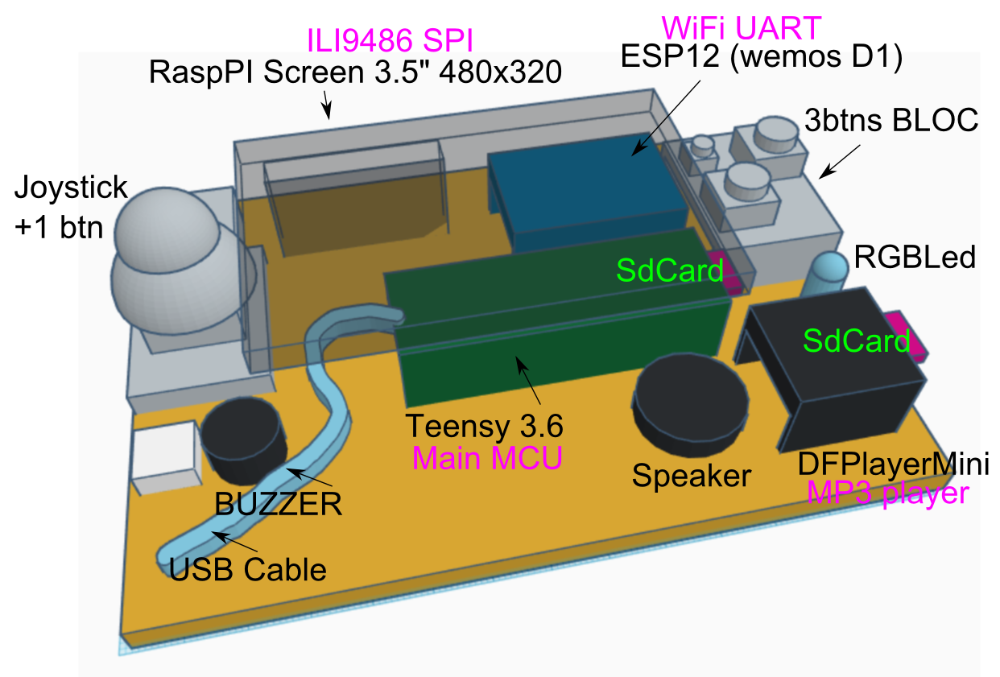
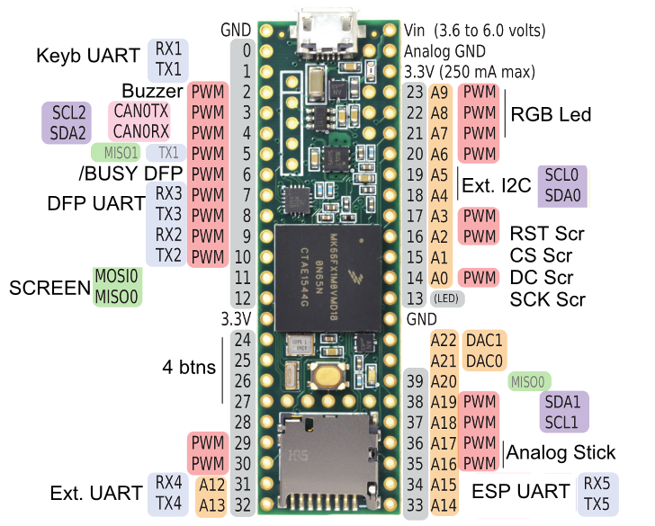

# XtsCPM v2.0

by Xtase - fgalliat @Feb 2020

**/!\\ Work in progress** (no completed package delivering for now)

- Current stage :

Now, it also provide a PC <u>TurboPascal IDE</u> (ide80) + a PC <u>Java/JNI emulator</u> (jni80)

You can see those @ [Java Tools](./src/java/README.md) Section

Teensy 3.6 based development board, with ESP12 for WiFi, DFPlayer for MP3 playback, BUZZER, AnalogStick, 3+1 buttons, the display is ensured by an ILI9486 3.5" TFT Screen (480x320).

| Side 1                                      | Side 2                                       |
| ------------------------------------------- | -------------------------------------------- |
|  |  |

The **main MCU is Teensy 3.6** with 180MHz single core, 1MB flash, 256KB of RAM.

It has easily wire able **5 UARTs**, **one SPI**, **one SDCard** slot, **2+1 I2C bus**.

The board currently run a version of XtsSupervisor + XtsCPM (w/ vZ80 emulation).

**for now, it can :**

- handle analog Joystick (2x 8 positions) + 4 btns
- display Console on TFT & Serial (vt100 like)
- play tone [files] on Buzzer
- playback MP3 on Speaker
- WiFi : connect to an AP, getID/SSID, call a remote REST service (~wget/curl)
- deals w/ RGBLed
- support SdCard FS
- support GFX drawings, BMP, PAK & Sprites
- call SuperVisor menu (to set console behavior, WiFi confs, audio (un)mute & test)
- **run XtsCPM v2 software layer** (w/ vZ80 Emulation (no cycles emulation))

**still TODO :** 

- wire & use Ext. ports x2
- /5v/GND/3.3v//TX/RX//SDA/SCL/GND/ bus x2

  

**wiring diagram :**

 