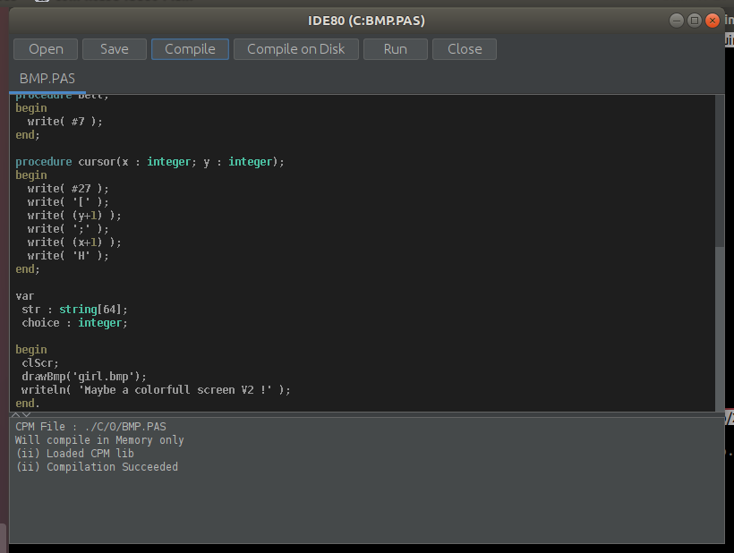

# IDE80 & JNI80

Xtase - fgalliat @May 2020 (part of XtsCPM2 project)

- **JNI80** is a YATDB emulator based on Java8 + cpp/jni (hardware emulation core)

  - 
  - it uses some parts of real YATDB (Teensy 3.6 MCU) cpp code to run
  - emulates YatDB cpm system, drive access, other devices (mp3Player, Screen, inputs Joypad+keyb, RGBLed) are written in Java
  - provides also an headless integration to run TP3 compiler in the IDE80 env. as example.

  

- **IDE80** is a Java TurboPascal IDE (code editor + TP3 Compiler based on JNI80 emulator)

  - 

  

  - It is Java8 written, and uses headless JNI80 emultion to launch TP3 compiler in memory-rendering to validate/compile opened .PAS Sources Files
  - It can also run (headfull) version of emulator to see compiled app. as on real Board.